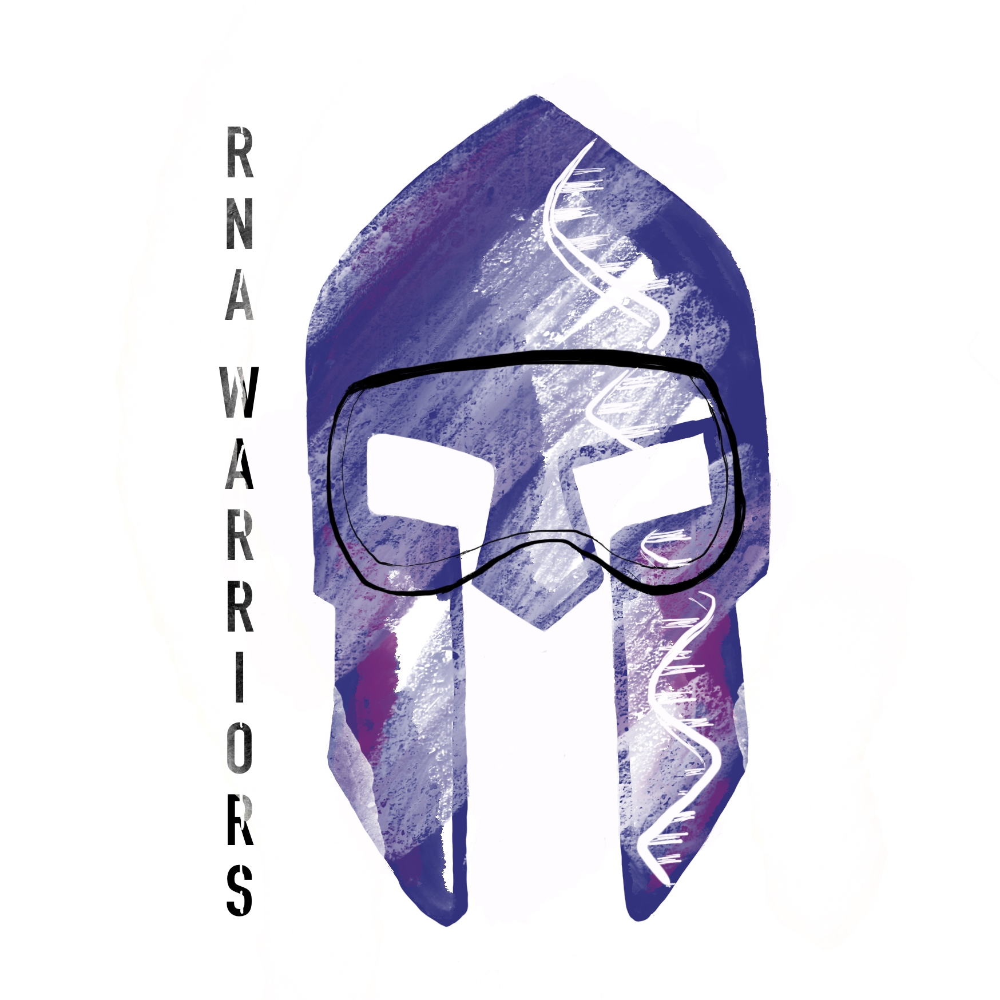

Title: Links
Date: 2016-04-21
icon: mdi mdi-link

## The Toughest Challenge for The Hardest Fight
[This year, Target ALS and Spartan Races have teamed up to launch a new global campaign to raise funds for breakthrough ALS research. Help us raise funds to fuel innovative research programs for ALS!](https://toughestchallenge.com/page/RNAWarriors)

## FAQ

[Frequently Asked Questions](http://yeolab.github.io/faq/)

## Courses
[BIOM262 Quantitative Methods in Genetics and Genomics](https://biom262.github.io/biom262-2016/)

## Meetings

[SingaRNA Symposium 2016](http://yeolab.github.io/singarna-symposium-2016/)

